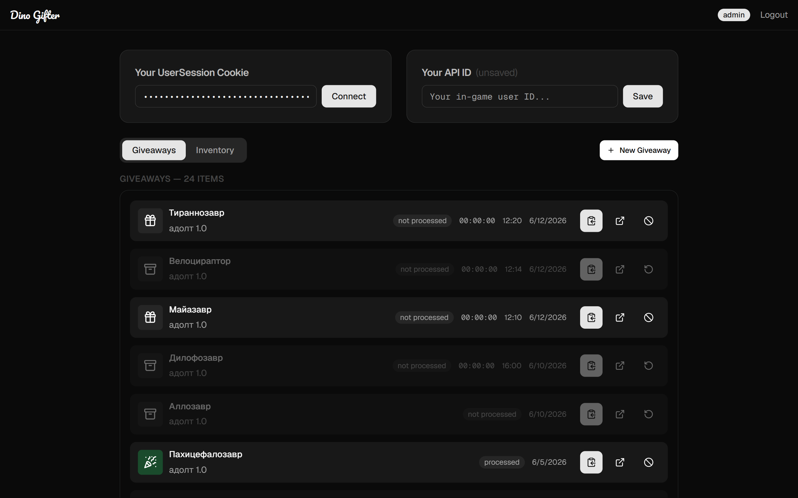
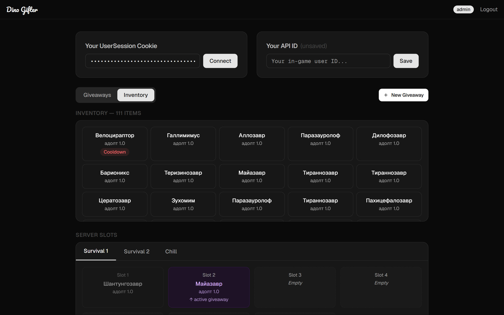
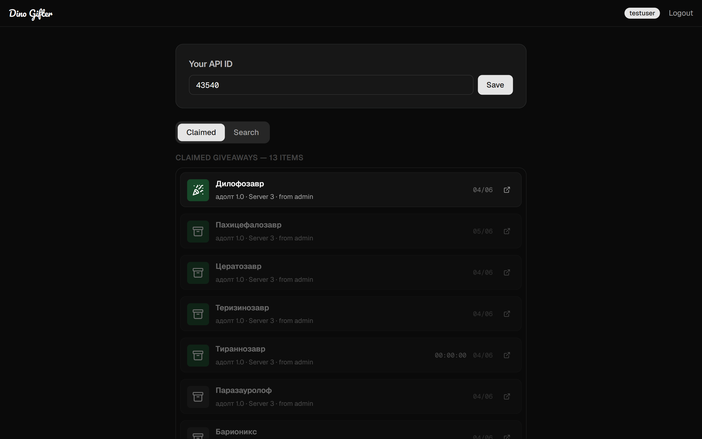
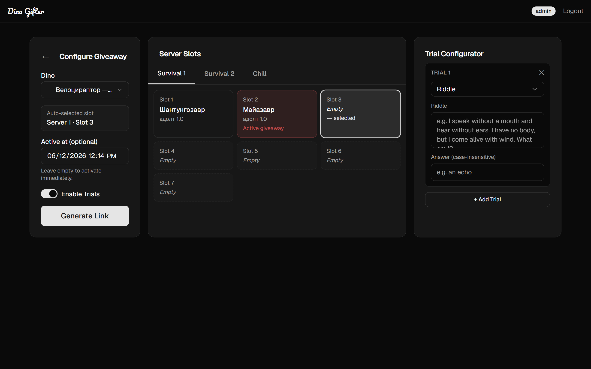
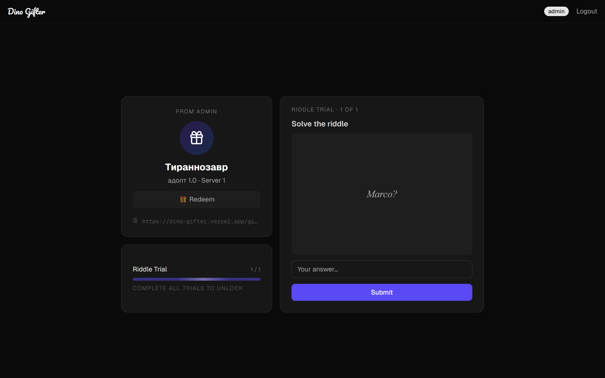
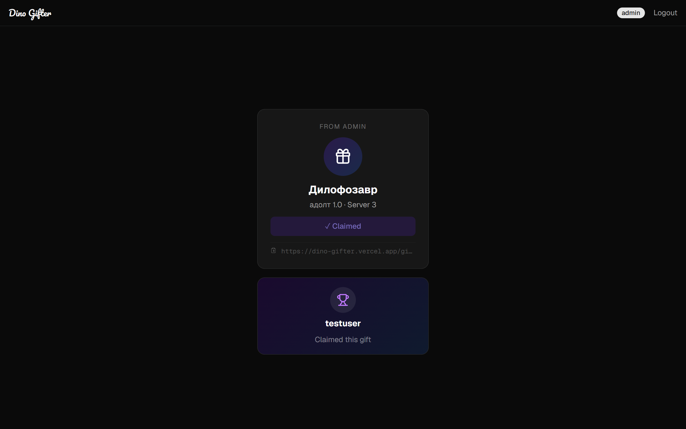

# Dino Gifter

A web application for the community server [Age of Dino](https://ageofdino.ru) (The Isle) that lets operators create dinosaur giveaways and regular users claim them — optionally gated behind interactive trials.

<a href="https://dino-gifter.vercel.app/" style="display: flex; align-items: center; gap: 8px;">https://dino-gifter.vercel.app/</a>

---

## How it works

1. **Operator** connects their game session, picks a dino from their inventory, and generates a shareable giveaway link (with optional trials and a scheduled activation time).
2. The app moves the dino to an in-game slot via the Age of Dino API and creates a giveaway record in the backend.
3. **Regular user** opens the link, completes any configured trials, and claims the gift.
4. A Pusher event triggers the operator's browser to automatically execute the in-game gift transfer.

> [!IMPORTANT]
> Both the **game session ID** (your `UserSession` cookie from ageofdino.ru) and a **community server ID** (your in-game API ID) are required to use this application. Without them, operators cannot manage inventory and regular users cannot receive gifts.

---

## Screenshots

| Operator — Giveaways | Operator — Inventory |
|---|---|
|  |  |

| User home | Configurator |
|---|---|
|  |  |

| Giveaway trial | Giveaway Claimed
|---|---|
|  | 

---

## Technology Stack

| Layer | Technology |
|---|---|
| Framework | Next.js 16 (App Router) |
| UI library | React 19 |
| Language | TypeScript 5 |
| Styling | Tailwind CSS 4 |
| Components | Radix UI + shadcn/ui |
| HTTP client | Axios |
| Real-time | Pusher |
| HTML scraping | Cheerio |
| Testing | Vitest + Testing Library |

---

## Project Structure

```
app/
  page.tsx                  — Home; renders OperatorHome or RegularHome by role
  login/page.tsx            — Login
  register/page.tsx         — Register
  giveaway/
    new/page.tsx            — Giveaway creation (operators only)
    [id]/page.tsx           — Giveaway claim page (public)
  api/
    slots/route.ts          — Fetches inventory + slot data from ageofdino.ru
    move-to-slot/route.ts   — Moves a dino from inventory into a server slot
    send-gift/route.ts      — Gifts the dino to the recipient in-game

components/
  giveaway/                 — GiveawayConfigurator, TrialConfigurator, CountdownTimer
  trials/                   — MathTrialPlayer/Editor, PuzzleTrialPlayer/Editor, …
  operator/                 — OperatorHome (giveaway list + inventory tabs)
  regular/                  — RegularHome (claimed list + search)
  game/                     — InventoryPanel, ServerTabs, SlotsGrid
  layout/                   — AuthGuard, Navbar, PusherProvider
  user/                     — ApiIdCard, SessionInput
  ui/                       — shadcn/ui primitives

lib/
  types.ts                  — All shared TypeScript types
  backend/api.ts            — Axios instance with JWT auth + 401 redirect
  backend/auth.ts           — localStorage auth helpers
  crawler/ageofdino.ts      — Low-level HTTP client for ageofdino.ru AJAX endpoints
  crawler/parse-slots.ts    — Cheerio parser for the slots page HTML
  crawler/redeem.ts         — Redemption helpers
  hooks/                    — useAuthUser, useSession
  frontend/                 — searchQuery, session (client-side storage helpers)
```

---

## Getting Started

### Prerequisites

- Node.js 18+
- A running backend API (for auth + giveaway persistence)
- A Pusher account (for real-time gift delivery)

### Installation

```bash
npm install
```

### Environment variables

Create a `.env.local` file in the project root:

```env
NEXT_PUBLIC_API_URL=http://localhost:8080   # backend base URL
NEXT_PUBLIC_PUSHER_KEY=your_pusher_key
NEXT_PUBLIC_PUSHER_CLUSTER=your_cluster
```

### Run locally

```bash
npm run dev
```

Open [http://localhost:3000](http://localhost:3000).

### Production build

```bash
npm run build
npm start
```

---

## Key Features

### For operators
- **Giveaway creation** — pick a dino from the in-game inventory, select a server, and generate a shareable link.
- **Scheduled activation** — set a future date/time; the link shows a live countdown until it becomes claimable.
- **Trial gate** — attach one or more trials (typing, math, riddle, puzzle) that the recipient must solve before redeeming.
- **Slot management** — visual grid of all server slots; slots with active giveaways are marked blocked to prevent conflicts.
- **Cancel / restore** — giveaways can be toggled canceled without deletion.

### For regular users
- **Claim page** — resolves trials step by step then enables a one-click redeem button.
- **Search** — find active giveaways by creator username.
- **Claimed history** — scrollable list of all previously won giveaways.

### Trial types

| Type | Challenge |
|---|---|
| `typing` | Type a given phrase exactly |
| `math` | Solve a math expression |
| `riddle` | Answer a text riddle |
| `puzzle` | Arrange a grid to match the solution |

### Real-time gift delivery

When a user redeems, the backend emits a `gift_dino` Pusher event on the operator's private channel. The operator's `PusherProvider` intercepts it and calls `/api/send-gift`, which:
1. Verifies the dino is on the expected slot.
2. Calls `ajax_changedino.php` on ageofdino.ru in Gift mode.
3. Confirms delivery by re-checking the slot (handles cases where the game returns an error but processes the gift anyway).
4. Reports `processed` or `failed` back to the backend.

---

## User Roles

| Role | Capabilities |
|---|---|
| `Regular` | Browse giveaways, complete trials, claim gifts |
| `Operator` | All Regular permissions + create/manage giveaways, view inventory |
| `Admin` | Defined in the type system; permissions managed by the backend |

Authentication is JWT-based; the token is stored in `localStorage` and attached as a `Bearer` header on every API request.

---

## API Routes

All routes live under `app/api/` and require an `x-user-session` header (the player's `UserSession` cookie from ageofdino.ru).

| Method | Path | Description |
|---|---|---|
| `GET` | `/api/slots` | Fetch slot cards and inventory for a server |
| `POST` | `/api/move-to-slot` | Move a dino from inventory to a free slot |
| `POST` | `/api/send-gift` | Gift the dino on a slot to a recipient |

---

## Testing

```bash
npm test           # run all tests once
npm run test:watch # watch mode
```

Tests use **Vitest** with a **jsdom** environment and **@testing-library/react**.

Test files live alongside source in `__tests__` directories:

```
components/__tests__/AuthGuard.test.tsx
components/__tests__/CountdownTimer.test.tsx
components/__tests__/MathTrialPlayer.test.tsx
components/__tests__/PuzzleTrialPlayer.test.tsx
components/__tests__/TrialConfigurator.test.tsx
components/__tests__/TypingTrialPlayer.test.tsx
lib/__tests__/ageofdino.test.ts
lib/__tests__/auth.test.ts
lib/__tests__/parse-slots.test.ts
lib/__tests__/redeem.test.ts
```
